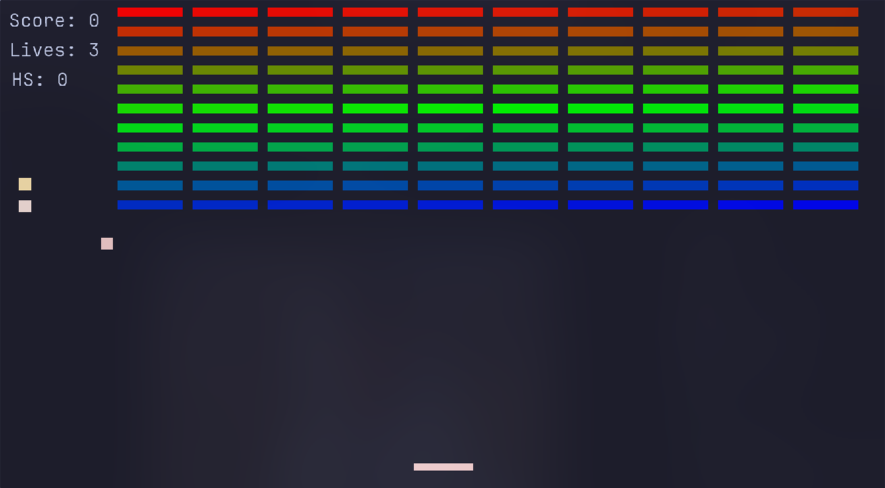

# pickle - Arkanoid but much better


## Controls

| Key    | Action              |
| ------ | ------------------- |
| A      | Move Left           |
| D      | Move Right          |
| W      | Move Forward        |
| S      | Move Backward       |
| J      | Decelerate the Ball |
| K      | Accelerate the Ball |
| Space  | Restart the Game    |
| Escape | Quit the Game       |

## Requirements

- Python 3.10 or later
- Pygame 2.6.1 or later

## Installation
### Arch Linux

```bash
   git clone https://github.com/NerdNinja420/pickle
   cd pickle
   ./install.sh
   pickle
```

## License

This project is licensed under the **MIT License**.  
